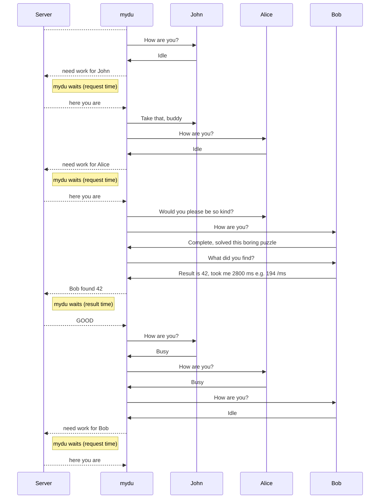


# Overview

I'm running  rigs  with one  ESP8266 12F and n Arduino Mini Pros connected by I2C. ESP runs a MicroPython program which communicates with the server via LAN and the MiniPros via I2C. For each Arduino one connection is made to the server. The Arduino runs a sketch which does the calculations.
Technically it's possible to have more MiniPros, but the problem is the time it takes to transfer from / to the server.  The ESP can only work on one Server connection at a time, real computers like Raspis can do something else while the server is busy.  
Why MicroPython? Because Arduino on ESP is aPitA, it takes long to compile and to transfer and i wanted to learn something new. And it was really worth it. 

# Hardware
A rig consists of 3 MiniPro and one ESP, currently those rigs are used:

ESP is in 3D-printed Housing (FreeCad esp12L), additionaly a Matrix board 11 rows at (3*3+1) is used to accomodate the additional 2 pullups and the levelshifter for the I2C. One  serves two ESPs

                3.3 V side 
    grn  blu  blk  red  grn  blu   
    SDA  SCL  GND  !!!  SDA  SCL    
    grn  blu  blk  whi  grn  blu   
                  5 V side
       

On Breakout board  ESP 12-F  used these wire  colors:

        pink    RST					TXD		white to RX
            	ADC					RXD		yello to TX
            	CH_PC			SCL	GPIO5 	blue
            	GPIO16			SDA	GPIO4	green 
            	GPIO14				GPIO0	grey
		        GPIO12				GPIO2	pup VCC
		    	GPIO13				GPIO15	pup GND
    	red     VCC			        GND		black

For RST and GPIO0 add a 10k Pullup to VCC and button to GND.
**Reset:**  press pink .
**Enter programming mode** : hold grey, press pink,  release pink,  release grey

# Master and Slave

## Slave
A slave can be in one of three run states (runS):

runS|   Meaning |     Subsequent states
---|---|---|---
| I |  Idle | B while processing requests from master    | 
| B |  Busy | C after Calculation or I after other requests  
| C |  Complete | I after master fetched results
| E |  Error | not used| 

## Serial Communication
Master sends 
Slave then starts calculating and sends back 

## I2C Communication

I did not want to change the max size 32 of a I2C message as used in Arduinos wire library.  Hashes used have size 40.  It would be possible to compress them (they have only 4 bit 0..9a..f); but this is not really the Knackpunkt as communication is quite fast. And already software of this kind was available (cluster solving Sudoku or finding primes ). The ESP is master and sends a command to a slave. The slave then provides data if required in a returnBuffer. Before the master reads this data, it checks if the slave has completed operation by quering the status. Technically the  slave has two I2C functions called asynchronously whenever a masters request for this address is received:

 - [ ] Wire.onReceive(receiveEvent):	a command is received
 - [ ]  Wire.onRequest(requestEvent):  the master fetches data from the slave
 

              

char|   Meaning | Example  |    Action by Slave
---|---|---|---|---
| A |  clear flags | A     |   sets runS to I
| D |  set difficulty  | tbd                     -
| E |  * provide exec time|not in ver c| sets *
| H |  hashme   | H| start hashing
| I |  provide ID          |I
| L |  lastblockhash 0:20  |L4e329de23..| store
| M |  lastblockhash 20:40|M4e329de23..| store
| N |  newblockhash 0:20|N4e329de23..| store
| O |  newblockhash 0:40|O4e329de23..| store start hashig
| R |  *  provide Result| not in ver c
| S |  *  provide Status| S| runS (runR slCmd)
| V |  set twi Adr |V8| set new Addres and reboot         -

# Master and Server
The communication with the server is reflected by status
sta|   Meaning | Slave  |    Comment
---|---|---|---|---
| D |  disconnected | ?     |   sets runS runR
| C |  connect succesful  | I|  connect reset  slave
| R |  request sent| I|
| J |  job received  |I|  hash to slave
| K |  transf. to slave|B |  Wait for slave 
| K |  transf. to slave|C |  slave C, reset
| E |  result sent     |I|
| F |  result response Error     |I|->C
| G |  result response Good     |I| ->C

# Software

Software consists of

 - boot.py		boot script or use your own 
 - webrepl_cfg.py access to ESP via   webREPL Password 
 -  i2ct.py	 
 - duclas.py 
 - mydu.py 
 - Setup

One major challenge is that for compiling the python code there must be enough free RAM available. Compiling is triggered by the first import statement, subsequent imports don't need this. use dir() to check the compiled modules
# boot.py

the cluster consists of several unit
## mydu
The main program has several commands for debugging purposes,
For daily ops only 3 are needed:
s to start  reads configuration file 
l to loop 99999 
if a key is pressed it returns to the menu
x  to exit
H> x
closed
closed
closed
MicroPython v1.15 on 2021-04-18; ESP module with ESP8266
Type "help()" for more information.
to restart use 
but do not use s again as the connections still exist

drop a connection with d, can use it everytime
l to
 loop
o overview 
i statistic 

              if ch=="a":
                    myc=inp
                    print ("myc=",inp)
                elif ch=="c":
                    myCons[myc].conn()
                elif ch=="d":
                    myCons[myc].close()
                    myCons.pop(myc)
                elif ch=="i":

  
                info()               
                    Target 11  Connected True
    Name >I2C 11 AVR newMiner (DUCO-S1A) v2.47<
    Requests  27
    ReqWait  17687  per  655
    SndWait  20686  per  766
    Ela  32951 Res 6407 Avg  194
    Targ Busy  71
    Last bcecc1a1f599c158538bfac6b897a6c897587204
    New  b03ba93d66dc1e1e4f8ae9670b4c4496b6ed1284
    Diffi  5

                elif ch=="l":
                    loop(0)  
                elif ch=="m":
                    myCons[myc].mach()                     
                elif ch=="n":
                    myCons.append(ccon(inp))  
                elif ch=="o":
                    overview()  
                    cons 3
11 C
12 C
13 C
                elif ch=="q":
                    print (myCons[myc].getStatus())
                    
                elif ch=="r":
                    print ("req",myc)
                elif ch=="s":
                    get_config()
                elif ch=="t":
                    myCons[myc].transfer() 
                elif ch=="w":
                    inp=myCons[myc].getResult()
                    print ("inp",inp)
                elif ch=="x":
                    for c in myCons:
                        c.close()
                    return

This is an example conversation, names have been changed (e.g. John could be I2C Device 27)

