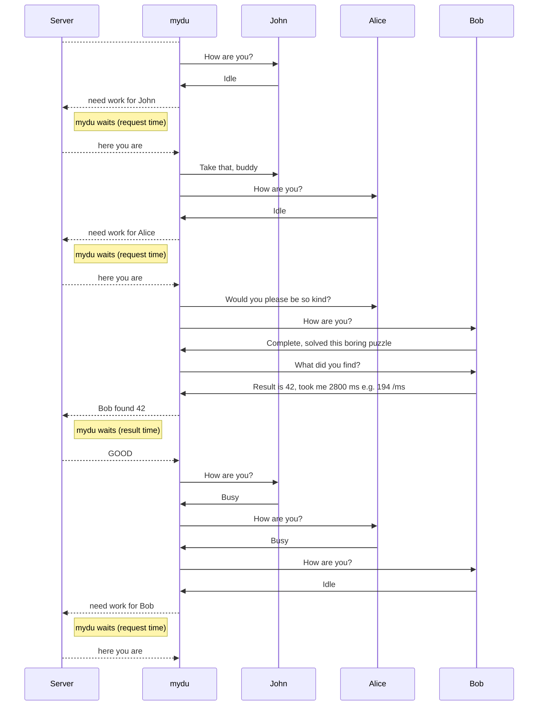


This document uses slackedit features, might be difficult to read with other readers. And of course this is work in progress.

# Overview

I'm running  rigs  with one  ESP8266 12F and n Arduino Mini Pros connected by I2C. ESP runs a MicroPython program which communicates with the server via LAN and the MiniPros via I2C. For each Arduino one connection is made to the server. The Arduino runs a sketch which does the calculations.
Technically it's possible to have more MiniPros, but the problem is the time it takes to transfer from / to the server.  The ESP can only work on one Server connection at a time, real computers like Raspis can do something else while the server is busy.  
Why MicroPython? Because Arduino on ESP is aPitA, it takes long to compile and to transfer and i wanted to learn something new. And it was really worth it. 

# Hardware
A **rig** consists of 3 or MiniPro and one ESP, currently those rigs are used:

ESP | IP| S | S | S| S        
---|---|---|---|---|---
|ESP-DF5B35 |192.168.178.39|25|26|27|
|ESP-DF942E |192.168.178.40|11|12|13|
|ESP-DF9478 |192.168.178.41|15|16|17|
|ESP-DF0369 |192.168.178.42|20|21|22|
|lgt8a |192.168.178.|30|31|32|33|
|lgt8b |192.168.178.|35|36|37|38|

In a **racket** rigs are one or more  rows  where RAW(!), GND, SCL and SDA are connected. 
Tis requires a certain kind of Minipro, the A4 and A5 connectors must be close to A3, some have it opposed to the 6-pin serial side. Btw there are also different serial connectors, sometimes they are inversed. Original has DTR (green) close to RAW, nowadays DTR is on the other side, close to TXD.  Pullups e.g. 4k7 for I2C should be used, although it works without because the MiniPro inputs use internal pullups. For ATtiny pullups are required.

 A row is 3d-printed (FreeCad RackGeh3 or RackGeh5), the vertical connectors are FreeCad Rack* in different length, screws are  SPAX yellow 2x10, ideally 4 per row.
The power and I2C busses are 2 row matrix board, with 2-pin female headers from left solder side:
These then fit the rows

                12345678901234567890
       Power        5       3
       I2C           6       4

ESP is in 3D-printed Housing (FreeCad esp12L), additionaly a matrix board 11 rows at (3*3+1) is used to accomodate the additional 2 pullups and the **levelshifter** for the I2C.
One  serves two ESPs. Btw: (of course) a level shifter for SDA and SCL  is needed as the MiniPros run with 5 V  and the ESP only 3.3V. 

                3.3 V side 
    grn  blu  blk  red  grn  blu   
    SDA  SCL  GND  VVV  SDA  SCL    
    grn  blu  blk  whi  grn  blu   
                 5 V side
       
On Breakout board  ESP 12-F  used these wire  colors:

		pink    RST					TXD		white to RX
            	ADC					RXD		yello to TX
            	CH_PC			SCL	GPIO5 	blue
            	GPIO16			SDA	GPIO4	green 
            	GPIO14				GPIO0	grey
		        GPIO12				GPIO2	pup VCC
		    	GPIO13				GPIO15	pup GND
		red     VCC			        GND 	black

For RST and GPIO0 add a 10k Pullup to VCC and button to GND.
**Reset:**  press pink .
**Enter programming mode** : hold grey, press pink,  release pink,  release grey
Fortunately this finger exercise is only required once in order to flash MicroPython.

For the **power supply** it is planned to to use 4x1.5V Ni-MH 2400 mAh  charged by the sun. The voltage varies up to 6 V, so the MiniPro RAW pin is used for VCC. 
For the ESP a step-down converter 1 A  (+ fat elkos) reduces the voltage to 3.3V.  One  ESP can draw up to 400 mA while sending, but only for a very short time.

 For the +5V of the levelshifters (very few mA only) used a low-drop 5 V regulator, could also use VCC from any MicroPro. 
 
 If running ATtiny85, another, more powerful 5V is required for 16 MHz.

All step downs are LM2596S which are cheap and really stable. They are contained in  FreeCad StepDown_B19 including a LED voltmeter and lots of Dupont Connectors.

Instead of the accus use a power adapter + step-down 1A to about 5.55 V  (+ fat elkos).:

    ACAdaper-- Stp-Dn 5.55 V  -- RAW MicroPro
						      -- Low Drop 5V -- levelshifter
			-- Stp-Dn 3.33 V -- ESP
			-- Stp-Dn 5.00 V -- ATtiny

# Master and Slave

## Slave
A slave can be in one of three run states (runS):  

|runS|Meaning |Subsequent states                            |
|----|--------|---------------------------------------------|
|I   |Idle    |->B while processing requests from master      |
|B   |Busy    |->C after Calculation or ->I after other requests|
|C   |Complete|->I after master fetched results               |
|E   |Error   |not used                                     |
        

## Serial Communication
Original plan was to use the serial interface. How can an ESP with one interface talk to n MiniPros? very simple, by using diodes, just have to tell the Minipros which one is  active:

							RX
							RX
		TX  --- to all 		RX
    ESP				
		RX	---	---	>| ---	TX
					>| ---	TX
					>| ---	TX
							
TX is usally high, only pulled down low while sending

Master sends special activation code, eg "A 2" means only slave #2 activates, the others switch to inactive (nevertheless they can calculate)
Slaves only send when active, else they wait.
Slave then starts calculating and sends back 
As the I2C solution works so flawlessly and the Serial is very helpful  for debugging ... 

## SPI Communication
SPI is very fast serial communication, but only 1:1. The slaves could be daisy-chained, but this makes wiring  and software more complicated.

    Master		Slave	Slave
     SCLK	-->	---		--
       DO  	-->	DI
        		DO -->	DI	
		DI        	<--	DO 

## I2C Communication

I did not want to change the max size 32 of a I2C message as used in Arduinos wire library.  Hashes used have size 40.  It would be possible to compress them (they have only 4 bit 0..9a..f); but this is not really the Knackpunkt as communication is quite fast. So the job is transferred in  4 chunks (see L,M,N,O below). When getting it running for the ATtiny85, it turned out that the buffer has a lenght of 16 only. Here we use LMNOPQ, see document tiny85. The difficulty is not required for the slave.
The ESP is master and sends a command to a slave. The slave then provides data if required in a returnBuffer. Before the master reads this data, it checks if the slave has completed operation by quering the status. Technically the  slave has two I2C functions called asynchronously whenever a masters request for this address is received:

 - [ ] Wire.onReceive(receiveEvent):	a command is received
 - [ ]  Wire.onRequest(requestEvent):  the master fetches data from the slave
 

              
|char|Meaning       |Example       |Action by Slave                    
|---|---|---|---
|A   |clear flags        |A                        |set runS to I                     |
|D   |set difficulty     |D06|    not used                                      |
|E   |provide exec time|E            |set backbuf                             |
|H   |hashme             |H                        |start hashing                      |
|I   |provide ID         |I    |set backbuf                             |                                   |
|L   |lastblockhash 0:20 |L4e329de23..             |store                              |
|M   |lastblockhash 20:40|M4e329de23..             |store                              |
|N   |newblockhash 0:20  |N4e329de23..             |store                              |
|O   |newblockhash 20:40  |O4e329de23..             |store start hashing                 |
|R   |*  provide Result  |R             |set backbuf                                   |
|S   |*  provide Status  |S         |set backbuf runS runR slCmd                  |
|V   |set twi Adr        |V42                      |set new Addres and reboot          |

# Master and Server
| Task               | Content
|---|---
|Master requests job  |JOB
|Server sends Job| hash1,hash2,diff
|Master sends Job to Slave|hash1,hash2,diff,\n
|Slave send result to Master|res,us,DUCOID\n
|Master sends result to Server|

The communication with the server is reflected by status:

|Sta|Meaning  |Slave|Nxt |Comment
|:---:|---|:---:|:---:|---
|D  |disconnected         |?    | -> C|sets runS runR      
|V  |waiting for ver      |I    | -> C|tbd poll to avoid long wait
|C  |connected            |I    | -> R|connect reset  slave
|R  |request sent         |I    | -> J| poll                    
|J  |job received         |I    | -> K|hash to slave       
|K  |transferred to slave     |B    | K |Wait for slave C
|K  |transferred to slave     |C    | -> W|and reset slave 
|W  |wait for send        |I    | -> E|to compensate fast slave
|W  |wait for send        |I    | -> K|retry if result was 0??
|E  |result sent          |I    | -> F|poll                    
|F  |result response Error|I    | ->C|                 
|G  |result response Good |I    | ->C    

             

Polling of the response occurs R and E 
There are PERformance times taken:

    PER getJob time between sending request an receiving result
    PER getRes time between sending result and receiving response
    
This is an example log from an ESP while running 3 slaves 25,26,27:

    25 PER getJob took 1729
    26 PER getJob took 1118
    27 PER getJob took 1150
    All Bus  1   all slaves busy, wait 100 ms
    ...
    All Bus  6
    25 ela: 1251 res: 241 rat: 193   25 completed 1251 ms
    25 PER getRes took 196			 	
    25 GOOD took 3331				total job time
    27 ela: 1650 res: 319 rat: 193	27 completed
    26 ela: 1989 res: 384 rat: 193
    25 PER getJob took 1317
    25 ela: 1363 res: 260 rat: 191
    26 PER getRes took 1922
    26 GOOD took 5097
    27 PER getRes took 2487
    27 GOOD took 5349
    25 PER getRes took 4721
    25 GOOD took 7468
    26 PER getJob took 5322
    27 PER getJob took 5096
    27 ela: 387 res: 74 rat: 191
    26 ela: 1353 res: 259 rat: 191
    25 PER getJob took 2678
    26 PER getRes took 524
    26 GOOD took 7262
    27 PER getRes took 1634
    27 GOOD took 7179
    26 PER getJob took 1945
    27 PER getJob took

# Software

Software consists of

 -  boot .py		boot script or use your own 
 - webrepl_cfg.py access to ESP via   webREPL Password 
 -  i2ct .py	 
 - duclas .py 
 - mydu .py 

One major challenge is that for compiling the python code there must be enough free RAM available. Compiling is triggered by the first import statement, subsequent imports don't need this. use dir() to check the compiled modules

## boot

## i2ct
i2ct provides routines for the basic functions which are called by mydu. additionally it's suited to debug the I2C behavior. As the menu fuctionality described below takes space, it might be commented out.

    >>> k=i2ct()
    >>> k.menu()
    I>
    d, q,w,e,z  h,r, q,w t  x  A H L M N O S
    d	shows I2C devices like scan: [25, 26, 27]
    t	select target: 26t  would select 26
    i	infos about selected target
        Free 20464
	              0123456789012345678901234567890123456789
	    Last  40 >2cbac32719086e89b856e17bd2a34f21032a51d2<
	    New   40 >0a536a14db3b230247d4d90c3b33abff25b64382<
	q	query status of target
	w	query result of target
	e	query elapsed of target
	z	query DUCOID of target
	h	sends hashes shown in info above and triggers calculation
	x	eXit
	capital letters are directly sent, see source, example:
	A	resets status to I
	L	send lasthash[0:20]
	M	send lasthash[20:40]
	N	send newhash[0:20]
	O	send newhash[20:40] (+slave starts calc.)
	H	calculate
    

## mydu
The main program has several commands for debugging purposes,
For daily ops only 3 are needed:
s to start  reads configuration file 
l to loop 99999 
if a key is pressed it returns to the menu
x  to exit
H> x
closed
closed
closed
MicroPython v1.15 on 2021-04-18; ESP module with ESP8266
Type "help()" for more information.
to restart use 
but do not use s again as the connections still exist

drop a connection with d, can use it everytime
l to
 loop
o overview 
i statistic 
              

Average values  when the server is in a good mood:

    Target 20  Connected True
    Name >I2C 20 AVR Miner (DUCO-S1A) v2.47<
    Requests  308				<- calculated 308 hashes
    ReqWait  271532  per  882	<- average 882 ms to request job
    ReqZwi  1060  per  3		<- thereof average 3 ms to send, rest 882-3 ms waiting
    SndWait  246115  per  799	<- average 799 ms to send result
    SndZwi  117  per  0			<- thereof average 0 ms to send
    Targ Busy  611				<- 611 times checking the Minipro had not yet completed calculation

With a hash rate of 160 difficulty 5 it takes the Arduino average 1500 ms maximum 3000 ms to calculate.  So for me it does not make sense to have more than 3 Arduinos per ESP as they  often wait for jobs but reduce the kolka rating.

Every  10 seconds a performance check program queries my  balance:
Using 3 rigs (e.g. 3 ESP<and 9 Arduinos) today shortly after the restart (?)  of  the server

    values below in milliDuco
    Time            Total  ping    10 sec    minute    Duco/d
    19:47:00       49.549   902     9.136    38.267     55.10
    19:47:10       53.310    16     3.760    37.420     53.89
    19:47:20       62.226   385     8.916    38.767     55.82
    19:47:30       66.221   168     3.995    38.202     55.01
    19:47:40       74.292    16     8.071    38.479     55.41
    19:47:50       80.716   453     6.424    40.303     58.04
At 19:47:10  the time to get the balance was 16 ms.  In the previos 10 seconds the balance increased by 0.003760 Duco, in the last minute (moving average) the balance increased by 0.037420 Duco which would be 53.89 Ducos a day. Unfortunately this is not the normal. Now i get
    
    21:55:50     2854.008   149     1.786    14.837     21.37
    21:56:00     2857.239   965     3.232    14.554     20.96
    21:56:10     2858.861   138     1.622    14.410     20.75
    21:56:20     2860.974   670     2.113    14.252     20.52
    21:56:30     2865.037   461     4.063    14.76
## mydu
The main program has several commands for debugging purposes,
For daily ops only 3 are needed:
s to start  reads configuration file 
l to loop 99999 
if a key is pressed it returns to the menu
x  to exit
H> x
closed
closed
closed
MicroPython v1.15 on 2021-04-18; ESP module with ESP8266
Type "help()" for more information.
to restart use 
but do not use s again as the connections still exist

drop a connection with d, can use it everytime
l to
 loop
o overview 
i statistic 

              if ch=="a":
                    myc=inp
                    print ("myc=",inp)
                elif ch=="c":
                    myCons[myc].conn()
                elif ch=="d":
                    myCons[myc].close()
                    myCons.pop(myc)
                elif ch=="i":

  
                info()               
                    Target 11  Connected True
    Name >I2C 11 AVR newMiner (DUCO-S1A) v2.47<
    Requests  27
    ReqWait  17687  per  655
    SndWait  20686  per  766
    Ela  32951 Res 6407 Avg  194
    Targ Busy  71
    Last bcecc1a1f599c158538bfac6b897a6c897587204
    New  b03ba93d66dc1e1e4f8ae9670b4c4496b6ed1284
    Diffi  5

                elif ch=="l":
                    loop(0)  
                elif ch=="m":
                    myCons[myc].mach()                     
                elif ch=="n":
                    myCons.append(ccon(inp))  
                elif ch=="o":
                    overview()  
                    cons 3
11 C
12 C
13 C
                elif ch=="q":
                    print (myCons[myc].getStatus())
                    
                elif ch=="r":
                    print ("req",myc)
                elif ch=="s":
                    get_config()
                elif ch=="t":
                    myCons[myc].transfer() 
                elif ch=="w":
                    inp=myCons[myc].getResult()
                    print ("inp",inp)
                elif ch=="x":
                    for c in myCons:
                        c.close()
                    return

This is an example conversation to learn mermaid, only readable if md-reader supports it, names have been changed (e.g. John could be I2C Device 27)

